# 竞品档案：G.Mondini TRAVE-350

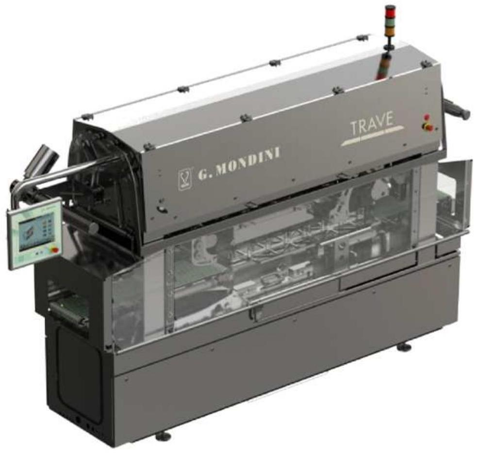

## General description

Tool sizes are 340 mm in width and 570 in length, number of trays per tool can be maximum 4 according to the tray dimension in travelling direction. Sealing tool driving system and sealing force generator consist in a fully electro-mechanical system.

## 总体描述

模具宽度为 340 毫米，长度为 570 毫米，根据托盘在行进方向上的尺寸，每个模具最多可容纳 4 个料盘。密封模具驱动系统和密封力发生器由一套全机电系统组成。

## Tray in feed

A belt is receiving the trays from a previous conveyor. Trays have to arrive aligned and at a suitable distance. A smart belt will pace and group the trays, independently of the previous pitch, to prepare them to be transferred to the sealing station. These two belts can handle random feeding speed and allow the machine to remain in stand by, which is important, both for fully automated solutions and for manual operations. Detection of the tray is provided by a single photo eye positioned above the travelling plane.

## 托盘进料

一条传送带正在接收来自前段输送线的托盘。托盘需以对齐且间距适当的方式到达。智能传送带会调节托盘速度并分组排列，不受前段节距影响，为转移至封口工位做好准备。这两条传送带可应对随机进料速度，使设备能保持待机状态，这对全自动化解决方案和人工操作都至关重要。托盘检测通过安装在传送平面上方的单个光电传感器实现。

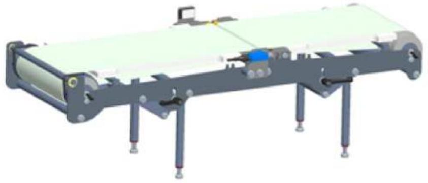

## Tray handling

To avoid tray shaking and excessive deceleration and acceleration of the product inside the tray, the handling is extremely smooth and accurate. Trays are moved from the smart belt to the sealing station through moving arms, which are gripping the group from the side. These arms are controlled by a servomotor system, whose main characteristics are smoothness, high speed, consistency, accuracy and extremely low maintenance and by a long-stroke pneumatic piston for the rotation to allow a very good smoothness and a wide range of settings.

## 托盘处理

为避免托盘振动以及托盘内产品过度减速和加速，处理方式极其平稳和精确。托盘通过侧面夹持托盘组的活动臂从智能传送带移送到密封站。这些活动臂由伺服电机系统控制，该系统具有平稳、高速、一致性、精准性和极低维护要求等特点，配合长行程气动活塞进行旋转，确保极佳的平稳性和宽泛的调节范围。

## Film unwinding and waste rewind

Film saving and reliable continuous run are at the base of the development of the system incorporated in this tray sealer. The reel is positioned on a cantilever shaft which is connected to a servomotor. Film is kept in tension through several shafts, which are supported both sides to avoid any misalignment. A dancing bar keeps a constant tension on the film during the unwinding. The film is pulled through the tool via two counter rotary rollers, controlled by an electrical motor, which allows smooth pulling to reach the maximum waste savings. A clutch controls the tension on the continuous running film waste rewind.

## 薄膜放卷与废料收卷

省膜设计和可靠连续运行是本托盘封口机集成系统的核心研发理念。膜卷安装于悬臂轴上，该轴与伺服电机直接相连。薄膜通过多根双端支撑的导辊保持张力，有效防止跑偏。浮动辊机构在放卷过程中持续维持薄膜张力恒定。薄膜由两根反向旋转的电动辊轮牵引通过模具，实现平稳拉伸以达到最佳省膜效果。离合器装置精确控制连续运行的废膜收卷张力。

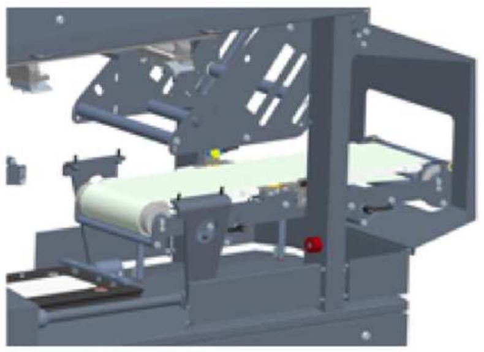

## Sealing Station

Once the trays are positioned in the sealing tool, the lower part is raised and the sealing process starts. High sealing force and consistency of sealing parameters are critical to guarantee the same seal characteristics tray after tray. The TRAVE-350 is equipped with a high duty system which is of an electromechanical type. A rod-crank system is controlling the motion up and down of the sealing tool, keeping an absolute control of the tool position while still very fast. The sealing force can reach 2200 Kg. Main characteristics of this solution are smoothness, high speed, very high consistency in sealing force, very high accuracy in positioning and extremely low maintenance.

## 密封工作站

一旦托盘位于密封工具中，下部分升起，密封过程开始。高密封力和密封参数的一致性对于保证逐盘相同的密封特性至关重要。TRAVE-350 配备了高性能电机械系统。杆-曲柄系统控制密封工具的上下运动，在保持绝对位置控制的同时保证速度极快。密封力可达 2200 公斤。该方案的主要特点是平稳、高速、密封力高度一致、定位精度极高和维护需求极低。

## Tooling

Each tray foot print has its own tool, but different tray heights are handled in the same tool. The construction is completely in anodised aluminium and all parts are machined from a single piece to reach the best accuracy in sealing pressure distribution. Each tray cavity supports the base of the sealing edge with a T section gasket to recover from different thickness in the packaging material. The location of the tray is as accurate as possible, due to tray size consistency, to reach the best results in seal location and film trimming. Sealing plates are made of aluminium-bronze, to keep the sealing temperature consistent in all contact points, the sealing profile varies according to the specific packaging material, it also contributes to remove contamination from the sealing area. Heating is provided by an element cast into aluminium. This solution provides a long lasting heater plate and a very accurate sealing temperature control: plus or minus five degrees between each point.

## 工装

每个托盘足迹都有其自己的工装，但不同的托盘高度可在同一工装中处理。结构完全采用阳极氧化铝制成，所有部件都从单一材料加工而成，以达到密封压力分布的最佳精度。每个托盘腔体都配有 T 形截面垫圈来支撑密封边缘的底部，以适应包装材料厚度的差异。由于托盘尺寸的一致性，托盘的位置设置得尽可能精确，以获得最佳的密封位置和薄膜切割效果。密封板采用铝铜合金制成，可以保持所有接触点的密封温度一致；密封轮廓根据特定的包装材料而变化，这也有助于清除密封区域的污染。加热由铸入铝中的加热元件提供。该解决方案提供了使用寿命长的加热板和非常精确的密封温度控制：各点间温度误差不超过五度。

## Out feed

A policord belt takes the sealed trays out of the guarding in a straight line.

## 出料装置

一条聚氨酯同步带将密封完成的料盘沿直线输送出防护区域。

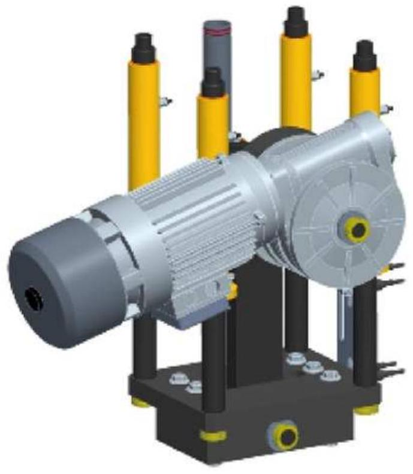

## Wash Down capabilities

Clean ability and resistance to continuous wash down is one of the main characteristic of this machine.

## 耐冲洗设计

该机器的主要特性之一是具备出色的清洁能力和持续耐冲洗性能。

## Hygiene Design

- Avoidance of contact between extended flat surfaces
- No closed cavities which can trap water and dirt
- No sensors below travelling plane
- Reduction of exposed nuts and bolts to increase easy cleanable surface
- One main electrical cabinet and one main mechanical cabinet

## 卫生设计

- 避免扩展平面之间的接触。
- 无可能积存水分和污垢的封闭空腔。
- 行驶平面下方无传感器。
- 减少外露的螺母和螺栓以增加易于清洁的表面。
- 一个主电气柜和一个主机械柜。

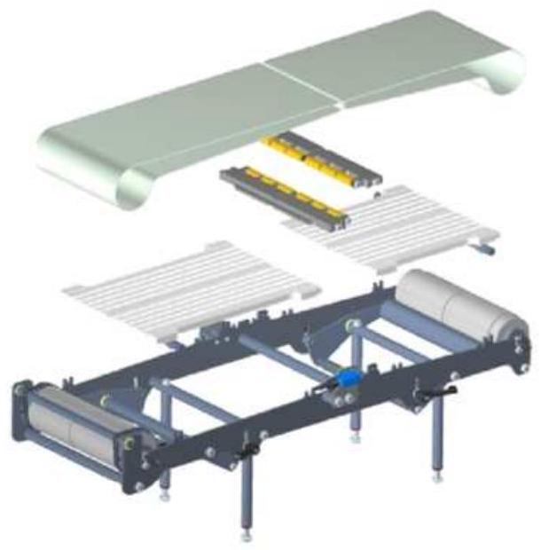

## Food grade materials

- Stainless steel for main body
- Anodised aluminium tool
- Belts in polyurethane

## 食品级材料

- 主体采用不锈钢材质。
- 阳极氧化铝制工具。
- 聚氨酯材质履带。

## IP Rate

- IP 65 mechanical cabinet
- IP 65 electrical cabinet
- IP 65 pneumatic and services cabinet
- IP 67 control panel
- IP 67 control switches
- IP 67 photo eyes with quick release for quick substitution
- IP 67 proximity sensors with quick release for quick substitution

## 防护等级

- IP 65 机械柜。
- IP 65 电气柜。
- IP 65 气动及辅助设备柜。
- IP 67 控制面板。
- IP 67 控制开关。
- IP67 防护等级的快速释放式光电传感器，便于快速更换。
- IP67 防护等级的快速释放式接近传感器，便于快速更换。

## Operations

Start, Stop, Reset, are simply controlled with standard and user friendly switches. All other settings are controlled via panel control. In this way the operators are free to use the machine without the risk of changing parameters which can jeopardize the efficiency. The list of parameters which are menu driven are:

- Sealing Temperature
- Sealing Time
- Vacuum Time (optional)
- Gas Time (optional)
- Film Unwinding Speed
- Length of film, by time

All previous parameters are stored into recipes to allow an easy and fast change over. Increased list of parameters are due for automatic lines.

## 操作说明

启动、停止、复位，这些操作都通过标准且用户友好的开关进行控制。所有其他设置则通过面板控制。这样操作人员可以自由使用机器，而无需担心误改参数影响效率。以下是通过菜单驱动的参数列表：

- 封口温度
- 封口时间
- 真空时间（可选）
- 气体时间（选填）。
- 薄膜解卷速度。
- 薄膜长度（按时间计算）。

所有上述参数均存储为配方，以便快速轻松地进行切换。自动生产线配方的参数列表有所扩充。

## Change Over

A full change over of the tray sealer can be done in ten minutes. All parameters are menu driven, in this way the skill requirement is very low. Both bottom and top tool slide out of the chassis of the machine. The top and the bottom tool are locked and unlocked through a pneumatic quick release system. No lifting is required by the operators.

## 更换

托盘封口机的全套更换可在十分钟内完成。所有参数均由菜单驱动，因此对操作技能要求极低。上下模具均可从设备机架中滑出。顶部与底部模具通过气动快速释放系统实现锁定与解锁，操作人员无需进行任何搬运作业。

## Performances (cycles per minute)

The product and the packaging material will determine exactly the cycle time. However, as a reference, we consider the following table of cycles per minute.

## 性能参数

具体循环时间由产品及包装材料决定。作为参考，我们提供以下每分钟循环次数对照表。

| 产品类型 | 热封盖 | 预切盖 | V&G | G 闭合 | L 闭合 |
| :--- | :---: | :---: | :---: | :---: | :---: |
| 固态 | 17 | 15 | 14 | 17 | 16 |
| 液体 | 10 | 10 | 8 | 10 | 10 |

## Maintenance

Being mainly a mechanical machine, all bearings, bushing, shaft etc need to be greased regularly. Each tool has its own greasing point.

## 维护

作为一台主要依靠机械运作的设备，所有轴承、衬套、轴等部件都需要定期润滑。每个工具都有其专门的润滑点。

## Mechanical Specifications

- Electrical Motors: Coel.
- Gear Box: STM
- Drum motor: Interrol
- Belts: Habasit

## 机械规格

- 电动机：Coel.
- 变速箱：STM
- 滚筒电机：Interrol
- 输送带：Habasit

## Pneumatic Specifications

- Metalwork

## 气动规格

- 金属加工（Metalwork）

## Health and safety

The machine is CE marked and comes with declaration of conformity.

## 健康与安全

该机器已获得 CE 标记，并随附符合性声明。

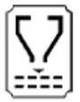

## Electrical Specifications (main components)

| 项目 | 品牌/型号 |
| :--- | :--- |
| 插座（辅助 220V） | Schuko |
| 主开关 | Merlin Gerin / Schneider |
| 按钮、选择器 22.5mm | Telemecanique / Schneider |
| 信号灯 22.5mm | Telemecanique / Schneider |
| 接口继电器 | Phoenix / Omron |
| 紧急停止安全继电器 | Telemecanique / Schneider |
| 24V 直流进料装置 | Telemecanique / Schneider |
| 电动机保护继电器 | Telemecanique / Schneider |
| 变频器 | B&R |
| 端子 | Phoenix |
| 温度控制器 | B&R |
| 总线系统 I/O | X2X-POWERLINK |
| 轴向通信 | POWERLINK |
| 多极插头连接器 | Ilme |
| 光电传感器 | Wenglor |
| 接近开关 | Telemecanique / Schneider |
| 安全开关 | AB Rockwell |
| 温度传感器 | PT 100 |
| 声学报警装置 | Telemecanique / Schneider |
| 信号灯塔 | Telemecanique / Schneider |
| PLC | B&R |
| 操作员面板 | B&R (PC) G.Mondini |
| 轴控制 | B&R |
| 轴电机 | B&R |

## Driving unit per Item

| 子系统 | 驱动配置 |
| :--- | :--- |
| 进料皮带 | AC 电机；可选：变频器（面板控制变速） |
| 分组皮带 | AC 电机；标准：变频器（面板控制变速） |
| 出口皮带 | AC 电机；可选：变频器（面板控制变速） |
| 机械臂平移 | 伺服电动机（SM） |
| 机械臂闭合 | 气动（PN） |
| 工具提升运动 | AC 电机 |
| 胶片进给 | 伺服电动机（SM） |
| 卷筒放线 | AC 电机；可选：变频器（面板控制变速） |

| 驱动类型 | 说明 |
| :--- | :--- |
| 异步电动机 | AC 电机 |
| 伺服电动机 | SM |
| 气动系统 | PN |
| 不适用 | NA |

## TRAY SEALER OPTIONS

## Vacuum & Gas

This option allows the production of modified atmosphere packs. It includes:

- Vacuum Pump: Busch 300 m3.
- Vacuum hoses and valves Gemu.
- Gas reservoir.
- Gas hoses and valves.
- Vacuum and Gas tool. The vacuum chamber is machined out of a single piece of aluminum to reduce the risk of leakage. Also all seals are lip seals type and greased with vacuum type grease. The minimum pressure reachable is below 4 mbar. These results are important to decrease oxygen residuals and to increase productivity.
- PLC software.

## 真空及气体（MAP）

此选项允许生产改良气调包装，包含：Busch 300 m³ 真空泵、真空软管与 Gemu 阀、气体储罐与软管阀、真空与气体工装（真空室整块铝加工，唇形密封并用真空脂润滑，最低压力 <4 mbar）、PLC 软件。

## Anti-explosion pump

It is mandatory whenever using high oxygen flows or gas mixing and the machine is sold with a vacuum pump.

## 防爆泵

使用高氧流量或气体混合时必须配备，机器配真空泵。

## High oxygen protection

All the vacuum valves and gas valves are provided with proximity sensor for positive detection of status (open and closed). A PLC which is separate from the main one checks that the vacuum and gas system is working properly for each cycle, avoiding a flow of missing gas to the vacuum pump. In case of malfunctioning the machine detects it and goes in a state of alarm. Note: this system is not certified and it will be totally under the responsibility of the end user to be provided with suitable pumps for the type of product to be packed.

## 高氧保护

所有真空阀与气体阀均配接近传感器做状态检测。独立 PLC 每循环校验真空与气体系统，避免缺气流向真空泵；异常时进入告警。注意：本系统未经认证，由最终用户完全负责配备适合所要包装产品类型的合适泵。

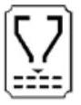

## By-pass belt

By-pass belt suitable for allowing un-sealed trays to pass through the sealing station without being heat sealed. The by-pass belt is positioned in the place of the sealing tool where there are trays which have to by-pass the sealing station.

## 旁通带

旁通带允许未热封托盘通过密封站。该带位于需要旁通的托盘位置处替代密封工装。

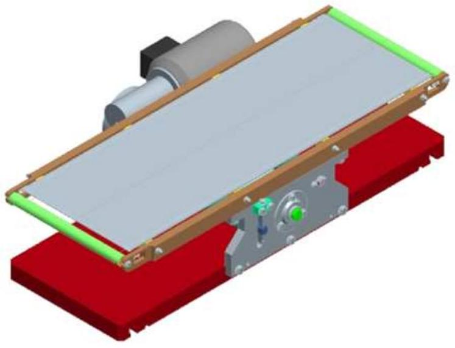

## Pre Cut Lid

A shuttle system allows the machine to pick pre cut lids from the side magazine located on the side of the tool. This option includes: Shuttle structure, Vacuum generator, Hoses and electro valves, Tool with side magazine, PLC software.

## 预切盖

穿梭系统从侧面料仓取预切盖并放置于密封轮廓，吸盘保压定位。此选项包括：梭形结构、真空发生器、软管与电磁阀、侧仓工装、PLC 软件。需机器预配预切盖穿梭。

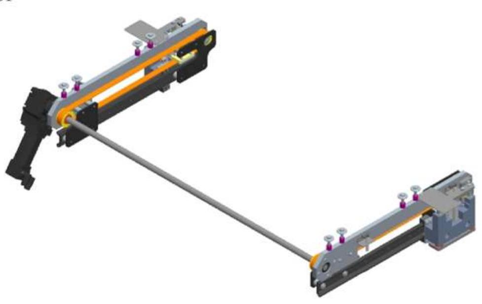

## Printed Film Registration

A photo eye detects the marking log on the printed film and stops it in the right position to have the printing centred on the tray. An accurate film lay out is provided for each tool to allow a proper film printing.

## 印刷胶片定位

光电检测印刷标记并使胶片停于正确位置以实现印刷居中。每套工装提供精确胶片版式以保证印刷。

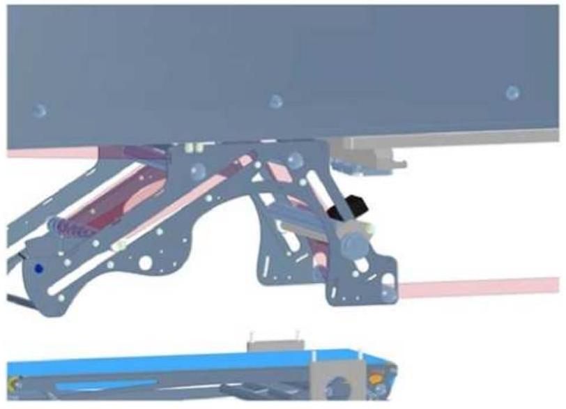

## TOOLING & TOOL OPTIONS

## Pre Cut Lid.

Lids are stored on the side of the tool. A pick and place removes the lids from the base of the pile, or the piles, via suction cups, then position the lid on the sealing profiles. Suction cups retain the lid in position. To use this tool the machine has to be predisposed with the pre cut lid shuttle.

## 预切盖子

盖子储存在工装侧，吸盘取放并定位于密封轮廓；需预配预切盖穿梭。

## Inside Cut.

This option allows the tool to cut the film inside of the perimeter of the tray. Such solution can be used to: Avoid film protruding the edge of the tray; To run cups or trays with protrusions or handles from round sealing profile, without need of keeping them aligned; To seal special tray with sealing surface below the maximum height of the tray.

## 内部切割

允许在托盘周界内侧切膜，用于：避免膜超边；适配带把手或突起托盘无需对齐；密封面低于托盘最高点的特殊托盘。无需预设。

## Alum Foil Crimping.

This tool cuts a lid from a reel of aluminium and crimps it around the tray. The aluminium has to be at least 40 micron thickness. No predisposition is required.

## 铝箔压接

从铝箔卷切盖并压接到托盘四周，铝箔≥40μm；无需预设。

## Pre Cut Lid Crimping.

Pre-shaped lids are stored in a side magazine. A pick and place system removes the lids from the base of the pile, or the piles, via suction cups, then positions the lid on the sealing profiles. Suction cups retain the lid in position. To use this tool the machine has to be predisposed with the pre cut lid shuttle.

## 预切盖压接

预成型盖侧仓储存，吸盘取放定位，需预配预切盖穿梭。

## Double heater plate.

In case of aluminium tray, to decrease the required sealing time and to reduce the sealing temperature, which damages the lid, a second heater plate is positioned in the bottom part of the tool. Sealing profile is heated from the top and the bottom, sealing time is reduced by half the time compared to a standard solution. A water cooled bottom plate avoids the transfer of the heat to the main machine body. The machine has to be predisposed to run two independent heater plates.

## 双加热板

用于铝托盘以缩短密封时间和降低密封温度：底部增设第二加热板，上下双面加热，时间减半；底板水冷避免热传导至机体。需机器预配双加热板独立控制。

## Extra Equipment

## 工具推车

Positioned to the side of the tray sealer, assembled on wheels and locked in position, the bottom and top tool can be transferred into the trolley very easily. The top tool is automatically secured in position once the trolley is unlocked from the tray sealer. Now the trolley can be taken to the maintenance area. The top tool can be rotated up-side down through a gear box helping a lot cleaning and maintenance. Stainless steel construction.

位于机器侧并锁定定位，上下工装可轻松转移至推车；解锁后上工装自动锁固，可翻转倒置便于清洁与维护；不锈钢结构。

## 液压工具推车

Compared to the standard trolley, it has an hydraulic levelling system. For this reason it can be adaptable in height to the different TRAVE and to the tool racks avoiding to act on handle-wheels.

相较标准推车，具液压调平；可适配不同 TRAVE 与刀具架高度，无需手轮调整。

## 双面刀具车

This is a two-faced trolley with the possibility to extract the tool from both right and left handed machines. Asymmetric hooks avoid possible matching errors between trolley and machine.

可从左右手位机型均可取出工装；不对称挂钩避免推车与机体匹配错误。

## 刀具架

To easily accommodate the different tools a tool rack, in stainless steel, is available. It can also be equipped with wheels or pre heating station.

不锈钢刀具架可容纳不同工装，可选配轮子与预热站。

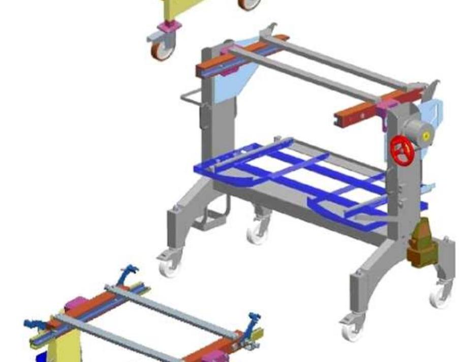